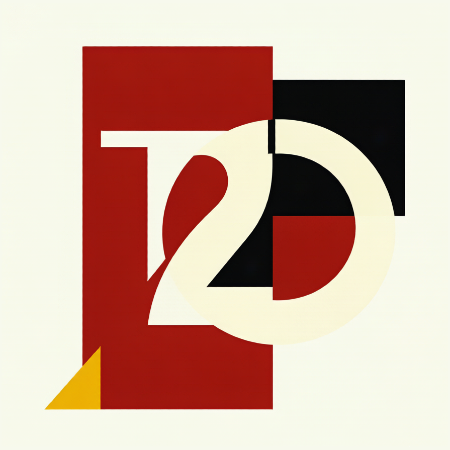

<a id="readme-top"></a>

<!-- PROJECT SHIELDS -->
[![Contributors][contributors-shield]][contributors-url]
[![Forks][forks-shield]][forks-url]
[![Stargazers][stars-shield]][stars-url]
[![Issues][issues-shield]][issues-url]
[![MIT License][license-shield]][license-url]
[![Python][python-shield]][python-url]

<!-- PROJECT LOGO -->
<br />
<div align="center">
  <a href="https://github.com/Codyzzz-zach/Text2Code">
    
  </a>

  <h3 align="center">Text2Code</h3>

  <p align="center">
    将自然语言文本转化为可执行的知识代码
    <br />
    <a href="README.md">English</a>
    &middot;
    <a href="https://github.com/Codyzzz-zach/Text2Code/issues/new?labels=bug&template=bug-report---.md">报告 Bug</a>
    &middot;
    <a href="https://github.com/Codyzzz-zach/Text2Code/issues/new?labels=enhancement&template=feature-request---.md">请求功能</a>
  </p>
</div>

<!-- TABLE OF CONTENTS -->
<details>
  <summary>📑 目录</summary>
  <ol>
    <li><a href="#关于项目">关于项目</a></li>
    <li><a href="#工作原理">工作原理</a></li>
    <li><a href="#输出格式">输出格式</a></li>
    <li><a href="#快速开始">快速开始</a></li>
    <li><a href="#使用方法">使用方法</a></li>
    <li><a href="#项目结构">项目结构</a></li>
    <li><a href="#设计文档">设计文档</a></li>
    <li><a href="#贡献">贡献</a></li>
    <li><a href="#许可证">许可证</a></li>
  </ol>
</details>

---

<!-- 关于项目 -->
## 关于项目

Text2Code (T2C) 是一个**文本→知识代码编译器**。它将原始自然语言文本（小说、法律条文、新闻等）通过 LLM 驱动的多阶段流水线处理，经 12 道校验门控，编译为结构化的 `.t2c.py` Python 模块。

输出不是数据库、不是图谱——而是**代码**。每个实体、事件、声明、关系都变成一个带类型的 Python 变量，附带精确的原文溯源、跨文件引用和完整的可验证性。生成的 `.t2c.py` 文件可导入、可校验、可被代码智能工具（CodeGraph、Pyright、Sourcegraph）原生导航。

**为什么"代码即知识"？**

- 🔍 **可溯源** — 每个知识对象携带 `EvidenceRef`，指向原文精确字符偏移
- 🧩 **可组合** — 跨文件 Python import 将实体、声明、关系连接为可导航的知识图谱
- ✅ **可验证** — 12-gate 校验管线保证结构正确性、引用完整性和认识论安全性
- 🔧 **工具原生** — 标准代码智能（go-to-definition、find-references）开箱即用

<p align="right">(<a href="#readme-top">回到顶部</a>)</p>

---

<!-- 工作原理 -->
## 工作原理

```
raw.txt ──► Segment ──► Extract(LLM) ──► Validate ──► Compact ──► CodeGen ──► .t2c.py
```

| 阶段 | 模块 | 说明 |
|:-----|:-----|:-----|
| **Ingest** | `corpus.py` | 文本摄入、分块检测、哈希计算 |
| **Segment** | `segmenter.py` | 语义分段（中英文句子边界、对话、表格） |
| **Extract** | `extractor.py` | LLM 驱动的实体/事件/声明/关系提取 |
| **Validate** | `validator.py` + `schema.py` | 12-gate 结构与认识论校验，含修复 |
| **Compact** | `compact_candidate.py` | 去重、压缩、关系推导 |
| **CodeGen** | `codegen.py` | 确定性 `.t2c.py` 生成，含符号分配 |
| **Compile** | `compile_target.py` | 多文件编译输出 |

**核心基础设施：** `ontology.py`（Pydantic 类型系统） · `llm_config.py`（多提供商 LLM 配置） · `llm_cache.py`（确定性缓存） · `claim_safety.py`（6 条认识论规则）

<p align="right">(<a href="#readme-top">回到顶部</a>)</p>

---

<!-- 输出格式 -->
## 输出格式

每个文档编译为一个包含 8 个文件的 Python 包：

```
hongloumeng/ch01/
├── __init__.py        # 包标记
├── text.py            # Document + Block + Segment 对象
├── entities.py        # Entity 对象（含证据引用）
├── events.py          # Event 对象（含参与者引用）
├── claims.py          # Claim 对象（含模态与极性）
├── residuals.py       # 未覆盖段残差
├── derived.py         # 推导出的 Relation 对象
└── coverage.py        # 覆盖率报告
```

**示例输出** — 一个关于实体的声明，完全可溯源：

```python
# entities.py
ent_zh_64e599 = Entity(id='hlm_ent_0006', name='甄士隐', kind='person',
    evidence_refs=[EvidenceRef(segment=seg_0021, start=0, end=3,
                               quote_hash='sha256:ae447e...')],
)  # 甄士隐 (person)

# claims.py
claim_ent0006_at_ent0002 = Claim(id='hlm_clm_0001',
    subject=ent_zh_64e599, predicate='lives_in', object=ent_zh_1fba96,
    modality='asserted', polarity='positive',
)  # hlm_ent_0006 lives_in hlm_ent_0002
```

关键特性：
- **符号引用**（`subject=ent_zh_64e599`，而非 `subject='hlm_ent_0006'`）— CodeGraph 构建 `references` 边
- **跨文件导入**（`from .entities import ent_zh_64e599`）— go-to-definition 跨文件导航
- **行内注释**（`# 甄士隐 (person)`）— FTS5 全文搜索可命中中文名称
- **证据溯源** — 每个声明回链到原文精确偏移

<p align="right">(<a href="#readme-top">回到顶部</a>)</p>

---

<!-- 快速开始 -->
## 快速开始

### 前置条件

- Python 3.11+
- 完整抽取需要 LLM API Key。默认入口是 DeepSeek `deepseek-v4-flash`；
  不使用 LLM 的编译不需要 Key。

### 安装

```bash
# 克隆仓库
git clone https://github.com/Codyzzz-zach/Text2Code.git
cd Text2Code

# 创建虚拟环境
python3 -m venv .venv
source .venv/bin/activate

# 安装（含开发依赖）
pip install -e ".[dev]"
```

### 配置 LLM

```bash
cp .env.example .env
# 编辑 .env — 填入 T2C_LLM_API_KEY 或 DEEPSEEK_API_KEY
```

支持的提供商：

| 提供商 | 环境变量 | 默认模型 |
|:-------|:---------|:---------|
| DeepSeek | `T2C_LLM_PROVIDER=deepseek` | `deepseek-v4-flash` |
| MiniMax | `T2C_LLM_PROVIDER=minimax` | `MiniMax-M3` |
| Anthropic | `T2C_LLM_PROVIDER=anthropic` | `claude-3-5-sonnet` |
| OpenAI 兼容 | `T2C_LLM_PROVIDER=openai` | `gpt-4o` |

<p align="right">(<a href="#readme-top">回到顶部</a>)</p>

---

<!-- 使用方法 -->
## 使用方法

### 文本映射预检（无需 LLM）

```bash
t2c compile examples/corpus/case_001.txt \
  --output examples/knowledge/case_001 \
  --text-only
```

这只会生成可回放的 text map 包，用于低成本预检；它不是完整语义转写。

### 使用 LLM 完整提取

```bash
t2c compile data/rawtxt/红楼梦.txt \
  --output examples/knowledge/hongloumeng/full \
  --llm \
  --cache-mode read_write
```

日常复跑用 `--cache-mode read_only`；只有明确需要重新付费调用模型时才用
`refresh`。

### 运行测试

```bash
pytest                            # 完整测试套件
pytest tests/test_codegen_v3_3.py # 单模块测试
pytest -x -q                      # 遇到第一个失败即停止
```

<p align="right">(<a href="#readme-top">回到顶部</a>)</p>

---

<!-- 项目结构 -->
## 项目结构

```
Text2Code/
├── t2c/                        # 核心引擎
│   ├── pipeline.py             # 流水线编排
│   ├── cli.py                  # 公开 t2c compile 入口
│   ├── extractor.py            # LLM 提取器（compact-v1 协议）
│   ├── codegen.py              # 知识代码生成
│   ├── compile_target.py       # 多文件编译
│   ├── validator.py            # 12-gate 校验
│   ├── compact_candidate.py    # 紧凑协议解析与展开
│   ├── ontology.py             # Pydantic 类型系统（11 个模型）
│   ├── schema.py               # Schema 校验层
│   ├── claim_safety.py         # 6 条认识论安全规则
│   ├── llm_config.py           # 多提供商 LLM 配置
│   ├── llm_cache.py            # 确定性 LLM 响应缓存
│   ├── segmenter.py            # 语义文本分段
│   ├── corpus.py               # 原始文本摄入
│   ├── coverage.py             # 覆盖率报告生成
│   ├── parser.py               # .t2c.py AST 解析器
│   ├── symbol_analyzer.py      # CodeGraph 兼容性验证
│   ├── graph_builder.py        # 推导邻接图
│   ├── graph_api.py            # 只读图谱查询 API
│   └── object_store.py         # SQLite 对象存储
├── tests/                      # 测试套件（411 个测试）
├── scripts/                    # 提取脚本与工具
├── examples/                   # 示例语料与生成包
│   ├── corpus/                 # 原始文本样本
│   └── knowledge/              # 输出目录（.t2c.py 由 t2c compile 生成）
├── data/                       # 大型数据文件
│   ├── rawtxt/                 # 完整源文本
│   └── generated/              # LLM 生成的大文件
├── spec/                       # 设计文档
│   ├── t2c_design_v4.0.md      # 当前版本设计
│   └── archive/                # 历史版本（v3.0–v3.3）
├── .env.example                # 环境变量模板
└── pyproject.toml
```

<p align="right">(<a href="#readme-top">回到顶部</a>)</p>

---

<!-- 设计文档 -->
## 设计文档

| 版本 | 文档 | 核心创新 |
|:-----|:-----|:---------|
| v4.0 | [t2c_design_v4.0.md](spec/t2c_design_v4.0.md) | 编译器模型；CodeGraph 原生输出；12-gate 校验 |
| v3.3 | [t2c_design_v3.3.md](spec/t2c_design_v3.3.md) | 符号分配；跨文件引用；紧凑协议 |
| v3.0–v3.2 | [archive/](spec/archive/) | 图谱知识提取演进 |

<p align="right">(<a href="#readme-top">回到顶部</a>)</p>

---

<!-- 贡献 -->
## 贡献

开源社区因贡献而精彩。任何贡献都**深受感激**。

1. Fork 本项目
2. 创建功能分支（`git checkout -b feature/AmazingFeature`）
3. 提交更改（`git commit -m 'Add some AmazingFeature'`）
4. 推送分支（`git push origin feature/AmazingFeature`）
5. 发起 Pull Request

<p align="right">(<a href="#readme-top">回到顶部</a>)</p>

---

<!-- 许可证 -->
## 许可证

本项目基于 MIT 许可证分发。详见 [`LICENSE`](LICENSE)。

<p align="right">(<a href="#readme-top">回到顶部</a>)</p>

---

<!-- MARKDOWN LINKS & IMAGES -->
[contributors-shield]: https://img.shields.io/github/contributors/Codyzzz-zach/Text2Code.svg?style=for-the-badge
[contributors-url]: https://github.com/Codyzzz-zach/Text2Code/graphs/contributors
[forks-shield]: https://img.shields.io/github/forks/Codyzzz-zach/Text2Code.svg?style=for-the-badge
[forks-url]: https://github.com/Codyzzz-zach/Text2Code/network/members
[stars-shield]: https://img.shields.io/github/stars/Codyzzz-zach/Text2Code.svg?style=for-the-badge
[stars-url]: https://github.com/Codyzzz-zach/Text2Code/stargazers
[issues-shield]: https://img.shields.io/github/issues/Codyzzz-zach/Text2Code.svg?style=for-the-badge
[issues-url]: https://github.com/Codyzzz-zach/Text2Code/issues
[license-shield]: https://img.shields.io/github/license/Codyzzz-zach/Text2Code.svg?style=for-the-badge
[license-url]: https://github.com/Codyzzz-zach/Text2Code/blob/main/LICENSE
[python-shield]: https://img.shields.io/badge/Python-3.11+-3776AB?style=for-the-badge&logo=python&logoColor=white
[python-url]: https://www.python.org/
